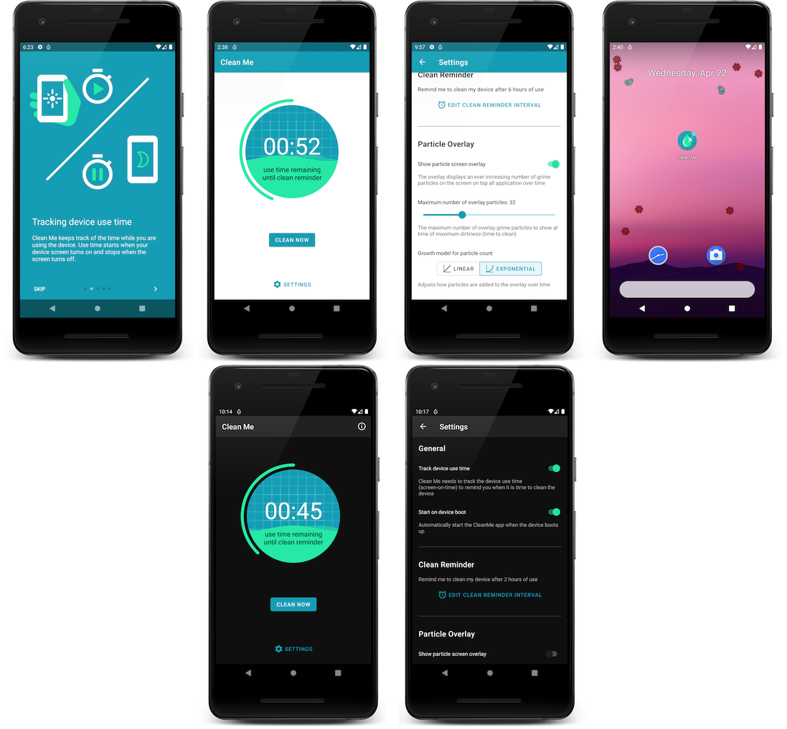

# Clean Me App
 

Clean Me is an Android app that reminds the user to regularly clean the device after it has been used for some time.

Additionally, the app can display a screen overlay with particles that increase in number over the devices use time as a reminder how the device gets dirtier over time.

  Download the app on Google Play

 

## Key Features
* Configurable device use time until clean reminder
* Particle overlay with customisable
  * particle size
  * maximum number of particles
  * particle transparency
  * growth rate (linear or exponential)
* Quick action to enable/disable particle overlay from service notification
* Explanatory welcome wizard
* Dark mode support

## How it works
Clean Me runs a foreground service that listens to screen-on/screen-off event broadcasts by the Android operating system.

As long as the device is in use, the app counts down a timer until the configured time interval for cleaning has been reached. Then the app shows a reminder notification.

If the particle overlay is enabled, the app adds particles randomly when the device is in use. The more time of the clean interval has elapsed, the more particles are shown until the time to clean has been reached.

Once the user clicks the *Clean Now* button on the main screen, the device usage timer and overlay particles are reset.

## Building and testing the App

### Build with Android Studio
1. Clone the git repo
2. Import the project into AndroidStudio
3. Compile the app and run the app on a Android emulator or connected device

### Build with gradle
1. Clone the git repo
2. Either set the `ANDROID_SDK_ROOT` environment variable or create a `local.properties` file with a `sdk.dir` property and point it to your Android SDK installation
3. build the app with `gradlew app:assembleDebug` or drectly run it with `gradlew app:installDebug`

### Testing

To run all unit tests run `gradlew app:testDebugUnitTest`. This will run all tests from **app/src/test** and **app/src/testShared**.

To run connected tests on a device or emulator run `gradlew app:connectedAndroidTest`. This will run all tests from **app/src/androidTest** and **app/src/testShared** on a emulator or device.

### Release build
Building for release requires a correctly configured signing configuration. This requires the following gradle properties to be set:

* `cleanme.signingConfig.release.storeFile`
* `cleanme.signingConfig.release.storePassword`
* `cleanme.signingConfig.release.keyAlias`
* `cleanme.signingConfig.release.keyPassword`

## License
This project is licensed under the terms of the MIT license. See the [LICENSE](LICENSE) file.
